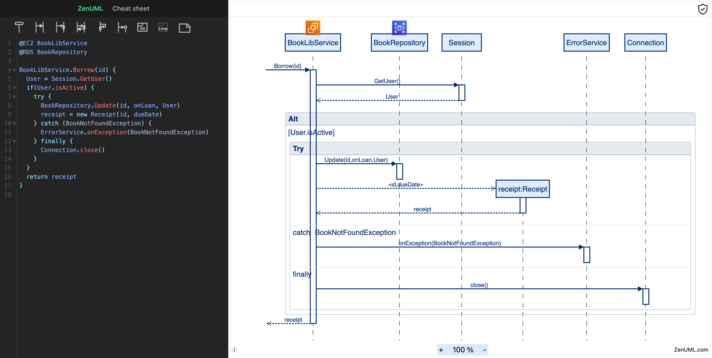

# ZenUML/Core

ZenUML is JavaScript-based diagramming tool that requires **no server**. It uses Markdown-inspired text definitions
and a renderer to create and modify sequence diagrams. The main purpose of ZenUML is to
help documentation catch up with development.

ZenUML allows even non-programmers to easily create beautiful sequence diagrams through
the [ZenUML Live Editor](https://app.zenuml.com).

You can use it ZenUML on your favorite platforms and applications:

- [Confluence](https://marketplace.atlassian.com/apps/1218380/zenuml-diagrams-for-confluence-freemium?hosting=cloud&tab=overview)
- [Web App](https://app.zenuml.com/)
- [JetBrains Plugin](https://plugins.jetbrains.com/plugin/12437-zenuml-support)
- [Chrome Extension](https://chrome.google.com/webstore/detail/zenuml-sequence/kcpganeflmhffnlofpdmcjklmdpbbmef)

# Integrations

ZenUML can be integrated with your favorite tools and platforms as a library or an embeddable widget.
Please follow the [integration guide](./docs/asciidoc/integration-guide.adoc) for detailed steps.

# Development

## Technical Requirements

These are the tools we use for working with the code and documentation:

- [volta](https://volta.sh/) to manage node versions.
- [Node.js](https://nodejs.org/en/). `volta install node`
- [pnpm](https://pnpm.io/) package manager. `volta install pnpm`
- [npx](https://docs.npmjs.com/cli/v8/commands/npx) the packaged executor in npm. This is needed [to install pnpm.](#install-packages)

Follow the setup steps below to install them and start the development.

### Switch to project

Once you have cloned the repository onto your development machine, change into the `zenuml-core` project folder (the top level directory of the @zenuml/core project repository)

```bash
cd zenuml-core
```

### Install packages

Run `npx pnpm install`. You will need `npx` for this because volta doesn't support it yet.

```bash
npx pnpm install # npx is required for first install
```

### Launch

```bash
npx pnpm run dev
```

## CI/CD

CI/CD is done with GitHub Actions. The workflow is defined in `.github/workflows/*.yml`.

## gh-pages.yml

This workflow has two jobs: `build` -> `deploy`.

```text
test  -> npm publish
      -> cy tests
      -> build site -> deploy gh-pages
```

This workflow is triggered on every push to the `main` branch.
It will build the project and publish the `dist` folder to the `gh-pages` branch.

## Put localhost on the internet

We sometimes need to put our localhost on the internet so that we can test it remotely.

Ngrok is a good tool for this. It is free for personal use. But if you want to use a
custom domain, you have to pay. If you want to use custom domain, we suggest Cloudflare
tunnels for this.

### Ngrok [TODO]

### Cloudflare tunnels [for collaborators only]

1. Start your local dev server at `8080` with `pnpm dev`.
2. Request a subdomain from the team. For example, `air.zenuml.com`.
3. You will be given a command that install a service locally. Run it.
4. Your localhost:8080 will be available at `air.zenuml.com`.

### Docker

To run the application using Docker, follow these steps:

1. **Build the Docker image**:
   Navigate to the root directory of the project and run the following command to build the Docker image:

   ```bash
   docker build -t zenuml-core .
   ```

2. **Run the Docker container**:
   After building the image, you can run the Docker container with the following command:

   ```bash
   docker run -p 8080:8080 zenuml-core
   ```

   This will start the application and map port 8080 of the container to port 8080 on your local machine.

3. **Access the application**:
   Open your web browser and navigate to `http://localhost:8080` to access the application.

Make sure Docker is installed and running on your machine before executing these commands.

# Code Structure

This repository contains both the DSL parser and the renderer.

The parser is generated with Antlr4. You can find the definition at `src/g4`. Generated parser is at `src/generated-parser`.
Parser enhancement with customised functionalities is in the `src/parser` folder.

Almost everything else under src are for the renderer. The render is based on VueJs 3.x.
